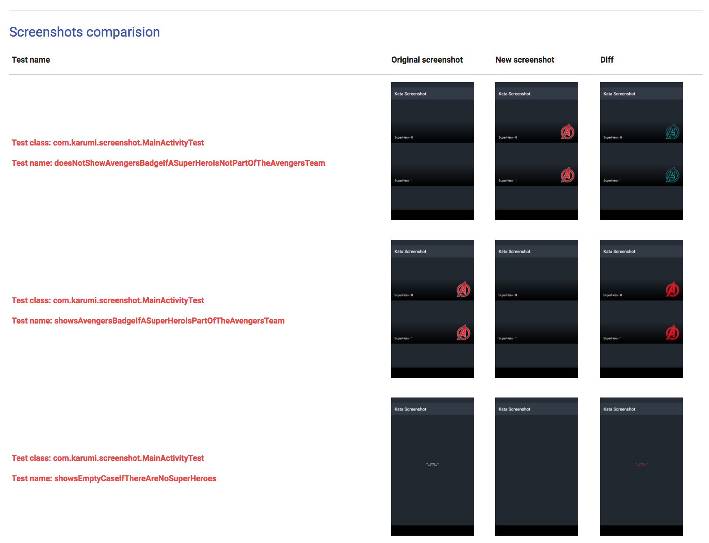
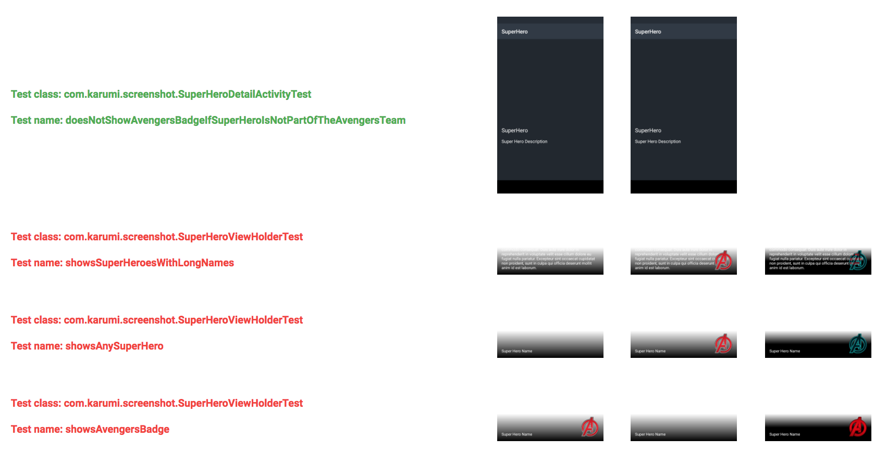
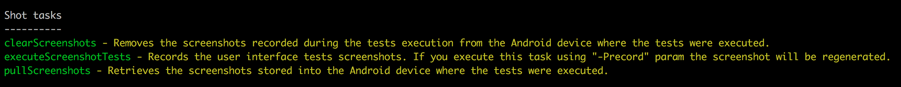
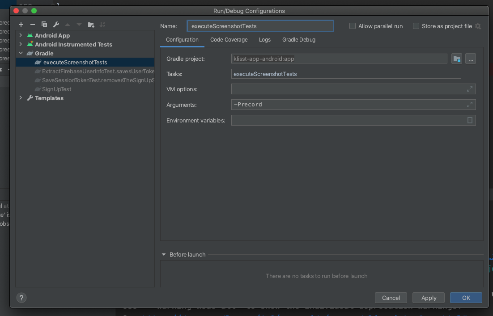

# ![Karumi logo][karumilogo]Shot 

Shot is an Android project you can use to write screenshot for your apps in a simple and friendly way.

## What is this?

``Shot`` is a Gradle plugin and a core android library thought to run screenshot tests for Android. This project provides a handy interface named ``ScreenshotTest`` and a ready to use ``ShotTestRunner`` you can use in order to write tests like these:

```kotlin
class GreetingScreenshotTest : ScreenshotTest {

    // If you are using regular Android views

    @Test
    fun theActivityIsShownProperly() {
        val mainActivity = startMainActivity();

        compareScreenshot(activity);
    }

    // If you are using Jetpack Compose

    @Test
    fun rendersGreetingMessageForTheSpecifiedPerson() {
        composeRule.setContent { Greeting(greeting) }

        compareScreenshot(composeRule)
    }
}
```

**Since Shot 5.0.0 we provide screenshot testing support for [Jetpack Compose](https://developer.android.com/jetpack/compose).**




Record your screenshots executing ``./gradlew executeScreenshotTests -Precord``


And verify your tests executing ``./gradlew executeScreenshotTests``


If Shot finds any error in your tests execution the Gradle plugin will show a report as follows:


You can find the complete Facebook SDK documentation [here](https://facebook.github.io/screenshot-tests-for-android/).

## Getting started

Setup the Gradle plugin:

```groovy
  buildscript {
    // ...
    dependencies {
      // ...
      classpath 'com.karumi:shot:5.10.2-SNAPSHOT'
    }
  }
  apply plugin: 'shot'
```

This plugin sets up a few convenience commands you can list executing ``./gradlew tasks`` and reviewing the ``Shot`` associated tasks:



**If you are using flavors the available Shot gradle tasks will be configured based on your flavors and build types configuration.** You can find all the available shot tasks by executing ``./gradlew tasks``. For example, if your app has two flavors: ``green`` and ``blue`` the list of available Shot tasks will be:

```groovy
executeScreenshotTests - Checks the user interface screenshot tests. If you execute this task using -Precord param the screenshot will be regenerated.
blueDebugDownloadScreenshots - Retrieves the screenshots stored into the Android device where the tests were executed for the build BlueDebug
blueDebugExecuteScreenshotTests - Records the user interface tests screenshots. If you execute this task using -Precord param the screenshot will be regenerated for the build BlueDebug
blueDebugRemoveScreenshotsBefore - Removes the screenshots recorded before the tests execution from the Android device where the tests were executed for the build BlueDebug
blueDebugRemoveScreenshotsAfter - Removes the screenshots recorded after the tests execution from the Android device where the tests were executed for the build BlueDebug
greenDebugDownloadScreenshots - Retrieves the screenshots stored into the Android device where the tests were executed for the build GreenDebug
greenDebugExecuteScreenshotTests - Records the user interface tests screenshots. If you execute this task using -Precord param the screenshot will be regenerated for the build GreenDebug
greenDebugRemoveScreenshotsBefore - Removes the screenshots recorded before the tests execution from the Android device where the tests were executed for the build GreenDebug
greenDebugRemoveScreenshotsAfter - Removes the screenshots recorded after the tests execution from the Android device where the tests were executed for the build GreenDebug
```

If for some reason you are running your tests on a different machine and you want to skip the instrumentation tests execution and just compare the sources remember you can use the following shot configuration:

```groovy
  shot {
    runInstrumentation = false
  }
```

Create this ``AndroidManifest.xml`` file inside your ``androidTest`` folder.

```xml
<?xml version="1.0" encoding="utf-8"?>
<manifest xmlns:android="http://schemas.android.com/apk/res/android"
    package="<YOUR_APP_ID>.test"
    android:sharedUserId="<YOUR_APP_ID>.uid">

</manifest>
```

**You'll have to add the same ``android:sharedUserId="<YOUR_APP_ID>.uid"`` configuration to your ``app/AndroidManfiest.xml`` file in order to let the testing APK write into the SDCard.**. If you don't do this, you can end up facing a weird error with this message while running your tests:

```
java.lang.RuntimeException: Failed to create the directory /sdcard/screenshots/com.example.snapshottesting.test/screenshots-default for screenshots. Is your sdcard directory read-only?
```

Remember to configure the instrumentation test runner in your ``build.gradle`` as follows:

```groovy
android {
    // ...
    defaultConfig {
        // ...
        testInstrumentationRunner "com.karumi.shot.ShotTestRunner"
    }
    // ...
```

We created this test runner for you extending from the Android one.

**If you want to use Shot to test your Android libraries code, you will have to configure the ``testApplicationId`` parameter as follows**

```groovy
android {
    // ...
    defaultConfig {
        // ...
        testApplicationId "<MY_TEST_APPLICATION_ID>"
    }
    // ...
```

Be careful and do not use the same id you are using for any other of the installed apps.

Now you are ready to use the ``ScreenshotTest`` interface from your tests:

```kotlin
class MyActivityTest: ScreenshotTest {
    @Test
    fun theActivityIsShownProperly() {
            val mainActivity = startMainActivity();
           /*
             * Take the actual screenshot. At the end of this call, the screenshot
             * is stored on the device and the gradle plugin takes care of
             * pulling it and displaying it to you in nice ways.
             */
            compareScreenshot(activity);
    }
}
```

Since Shot 5.0.0, if you are using Jetpack Compose your tests will look like this:

```kotlin
class GreetingScreenshotTest : ScreenshotTest {

    @Test
    fun rendersGreetingMessageForTheSpecifiedPerson() {
        composeRule.setContent { Greeting(greeting) }

        compareScreenshot(composeRule)
    }
```

***This interface is full of useful methods you can use to take your screenshots with your activities, dialogs fragments, view holders or even custom views***

You can find a complete example in this repository under the folder named ``shot-consumer`` or review [this kata](https://github.com/Karumi/KataScreenshotAndroid/).***

Now you are ready to record and verify your screenshot tests!

## ScreenshotTest interface

``ScreenshotTest`` interface has been designed to simplify the usage of the library. These are the features you can use:

* Take a screenshot of any activity by using ``compareScreenshot(activity)``. Activity height, width, background color and screenshot name are configurable.
* Take a screenshot of any fragment by using ``compareScreenshot(fragment)``. Fragment height, width and screenshot name are configurable.
* Take a screenshot of any dialog by using ``compareScreenshot(dialog)``. Dialog height, width and screenshot name are configurable.
* Take a screenshot of any view by using ``compareScreenshot(view)``. View height, width and screenshot name are configurable.
* Take a screenshot of any view holder by using ``compareScreenshot(holder)``. View holder height, width and screenshot name are configurable.
* Take a screenshot of any Jetpack Component  ``compareScreenshot(composeTestRule)``. The screenshot name is configurable.
* Take a screenshot of any SemanticInteractionNode  ``compareScreenshot(node)``. The screenshot name is configurable.

Before taking the screenshot, Shot performs some tasks in order to stabilize the screenshot. You can find the detail about the tasks performed in ``ScreenshotTest#disableFlakyComponentsAndWaitForIdle``:

* Invokes ``disableFlakyComponentsAndWaitForIdle`` method you can override if you want to add any custom task before taking the screenshot.
* Hides every ``EditText`` cursor.
* Hides every ``ScrollView`` and ``HorizontalScrollView`` scrollbars.
* Hides all the ignored views. You can specify the views you want to ignore by overriding ``viewToIgnore``.
* Wait for animations to finish and also waits until Espresso considers the UI thread is idle. This is really interesting if you are using Espresso in your tests.

**You can find examples of the usage of this interface and every feature mentioned inside the examples named ``shot-consumer`` and ``shot-consumer-flavors``.**

In case you need to override the inner dependency Shot includes in your project during the plugin configuration you can do it as follows:

```groovy
dependencies {
  ....
  shotDependencies "com.karumi:shot-android:ANY_VERSION_YOU_WANT_TO_USE"
  ....
}
```

Keep in mind you'll need to use a compatible version or Shot won't work as expected.

## ActivityScenario support

``ActivityTestRule`` has been deprecated and now the usage of ActivityScenario is recommended. However, Shot needs to be executed from the instrumentation thread to be able to extract all the test metadata needed to record and verify screenshots. That's why we've created an ``ActivityScenario`` extension method named ``waitForActivity``. This extension is needed get the activity instance from the instrumentation thread instead of running Shot from the app target thread. Using this extension you can write tests like this:

```kotlin
class MainActivityTest: ScreenshotTest {
    @Test
    fun rendersTheDefaultActivityState() {
        val activity = ActivityScenario.launch(MainActivity::class.java)

        compareScreenshot(activity)
    }
}
```

I hope we can find a better solution for this issue in the future.

## Recording tests

You can record your screenshot tests executing this command:

```shell
./gradlew <Flavor><BuildType>ExecuteScreenshotTests -Precord
```

or

```shell
./gradlew executeScreenshotTests -Precord
```

This will execute all your integration tests and it will pull all the generated screenshots into your repository so you can easily add them to the version control system.

## Executing tests

Once you have a bunch of screenshot tests recorded you can easily verify if the behaviour of your app is the correct one executing this command:

```shell
./gradlew <Flavor><BuildType>ExecuteScreenshotTests
```

or

```shell
./gradlew executeScreenshotTests
```

**After executing your screenshot tests using the Gradle task ``<Flavor><BuildType>ExecuteScreenshotTests`` a report with all your screenshots will be generated.**

[karumilogo]: https://cloud.githubusercontent.com/assets/858090/11626547/e5a1dc66-9ce3-11e5-908d-537e07e82090.png

## Executing tests from Android Studio

Shot is a Gradle plugin and it does not integrate with AS by default. After running your tests, Shot Gradle plugin will fetch the screenshots generated during tests' execution and use them to check if your tests are passing or not. You always can run your tests from command line as explained above. However, **if you want to run your tests from AS you can create a configuration like this**:



Keep in mind the debugger may not work if use use this option. If you want to debug your tests you can run them from Android Studio as you'd do with any other instrumentation test and you may need to execute this command before running your test:

```
adb rm -rf /storage/emulated/0/Download/screenshots/*
```

## Executing tests in multiple devices

If after some time writing screenshot tests your build takes too long to run our recommendation is to run your tests in multiple devices. **Sharding your tests execution will split your test suite into different devices so your tests execution time will be reduced. This feature is not designed to test the UI across different platforms or screen resolutions, to do that we'd recommend you to configure the size of the screenshot taken by modifing the view height and width.** To run your tests in multiple devices you can use [Composer](https://github.com/gojuno/composer) and the official [Gradle Plugin they provide](https://github.com/trevjonez/composer-gradle-plugin). Composer will take all your tests and will split the test suite execution between all the connected devices. **Remember, if you are going to use more than one device all the devices should use the same Android OS and the same screen resolution and density!** Keep also in mind composer needs Gradle 5.4.1 to be able to run your tests using multiple devices.

Once you've configured composer to run your tests you only need to update Shot to use the composer task as the instrumentation test task as follows:

```groovy
shot {
  useComposer = true
}
```

Take into account the ``instrumentationTestTask`` could be different if you use different flavors or build types. Remember also you should use Shot > 3.0.0 because this feature was introduced in this release!
 
## CI Reporting

Shot generates an HTML report you can review at the end of the recording or verification build. However, if you are running Shot in a CI environment which does not support saving the reporting files generated by the build you can verify your tests using this command ``./gradlew debugExecuteScreenshotTests -PprintBase64``. This will change how Shot show comparision errors displaying a command you can copy and paste on your local terminal for every screenshot test failed.

If you want to see only failing tests in output, please add `showOnlyFailingTestsInReports = true` as an option to your build.gradle.

## Running only some tests

You can run a single test or test class, just add the `android.testInstrumentationRunnerArguments.class` parameter within your gradle call. This option works for both modes, verification and recording, just remember to add the `-Precord` if you want to do the latter.

**Running all tests in a class:**

```shell
./gradlew <Flavor><BuildType>executeScreenshotTests -Pandroid.testInstrumentationRunnerArguments.class=com.your.package.YourClassTest
```

**Running a single test:**

```shell
./gradlew <Flavor><BuildType>executeScreenshotTests -Pandroid.testInstrumentationRunnerArguments.class=com.your.package.YourClassTest#yourTest
```

## Using shot on API 29+

Since Shot 5.8.0 we provide support for devices running API >= 29. There is no need to configure ``android:requestLegacyExternalStorage="true"`` or provide any special storage permission in your test ``AndroidManifest`.

## Development documentation

Inside this repository you'll find two types of projects. The first one is all the code related to the Gradle Plugin. The second one is all the code related to the example projects we use as consumers of the Gradle Plugin and also as end to end tests. Review the following folders when developing a new feature for Shot or fixing a bug:

Plugin related folders:

* shot: Main Gradle Plugin module.
* core: Gradle Plugin independent module where all the shot business logic is placed.
* shot-android: Android library included in the project where Shot is installed automatically when the Gradle Plugin is initialized.

Consumers and end to end tests folder:

* shot-consumer: A simple project created to test Shot and show how the library works.
* shot-consumer-flavors: A simple project focused on testing how the flavors feature works.

When developing a feature or fixing a bug, plugin related folders are the place where most of the code will be. When writing end to end tests you should review the consumers' folders. Unit or integration tests should be added in the first group of folders using all the tooling already installed and configured for you.

When talking about the IDE we should use, our recommendation is simple. We should use [IntelliJ Idea](https://www.jetbrains.com/idea/) for the Gradle Plugin related code and [Android Studio](https://developer.android.com/studio) for the consumers. Keep in mind the consumers' configuration is not linked with the root Gradle file so you won't be able to build the consumers from the root of this project using Android Studio. That's why we recommend the usage of different IDEs using different root Gradle configurations when working with this repository.

### Steps to develop a feature or fix a bug:

* Review our ``CONTRIBUTING.md`` file. There you'll find some general development rules.
* Open an issue or drop a comment to explain what you'd like to implement or to fix. Communication is really important for us and we recommend dropping a comment or opening an issue before to avoid development issues.
* Fork this repository and create a new branch where you'll develop the new feature or fix.
* Install IntelliJ and Android Studio.
* Import the root Gradle file configuration with IntelliJ. You will have to install the Scala plugin recommended by IntelliJ, but don't worry, as soon as you start IntelliJ you'll see a pop-up with the recommended plugin.
* Develop the code you'd like to implement. Remember to add the unit/integration test coverage to the code you are working on.
* Execute the Gradle task ``./gradlew uploadArchives`` from the root folder in order to update your plugin local installation.
* Using Android Studio import ``shot-android`` or ``shot-consumer-flavors`` and write an example of the feature or fix you coded before. The example test you write will work as an end to end test.
* Commit and push the code. Our CI configuration will ensure everything is working as expected!
* Remember to execute ``./gradlew uploadArchives`` whenever you change the Gradle plugin code related in order to update your local repository and be able to use it from the consumers folder.
* Once you are ready, send a PR. We will review it and help you to contribute to the official repository. Once everything is ready, we will merge it and release a new version.

In case you need to start an Android emulator you have scripts inside the consumers' folder you can execute to create the emulators you'll need to run the tests :smiley:

This is the list of most useful Gradle tasks you might need divided by type of project:

* Plugin related tasks:

    * ``./gradlew uploadArchives``: Install Shot in your local gradle repository.
    * ``./gradlew test``: Execute all the tests related to the Gradle plugin.
    * ``./gradlew scalafmtAll`: Review the Gradle Plugin's checkstyle.

* Consumers related tasks:

    * ``./gradlew executeScreenshotTests``: Execute all the screenshot tests for the associated consumer in verification mode.
    * ``./gradlew executeScreenshotTests -Precord``: Execute all the screenshot tests for the associated consumer in record mode.

## iOS support

If you want to apply the same testing technique on iOS you can use [Swift Snapshot Testing](https://github.com/pointfreeco/swift-snapshot-testing)

License
-------

    Copyright 2018 Karumi

    Licensed under the Apache License, Version 2.0 (the "License");
    you may not use this file except in compliance with the License.
    You may obtain a copy of the License at

       http://www.apache.org/licenses/LICENSE-2.0

    Unless required by applicable law or agreed to in writing, software
    distributed under the License is distributed on an "AS IS" BASIS,
    WITHOUT WARRANTIES OR CONDITIONS OF ANY KIND, either express or implied.
    See the License for the specific language governing permissions and
    limitations under the License.
